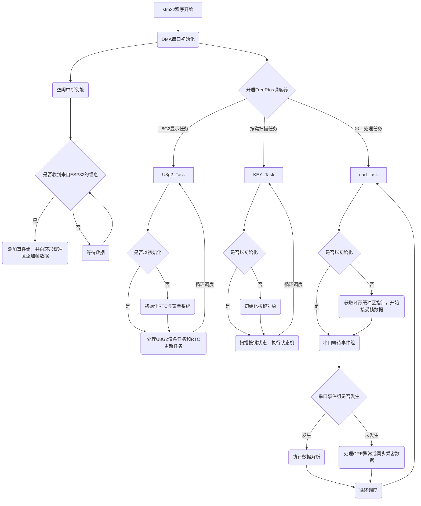
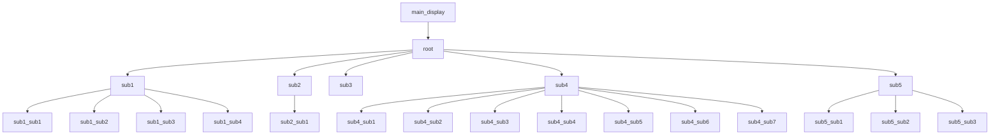

# 公交车项目详解和引脚配置

---

[toc]

---

## 项目执行目前总览

## 执行详解

当前项目分为了很多模块，包括菜单模块(`menu.c`)、按键模块(`multikey.c`)、协议模块(`protocol.c`)、日志模块(`Log.c`)

+ 菜单模块:提供树状链表的数据结构 + u8g2图形库的支持，目前以完成了基本的菜单需求，包含很多节点类型

  | 节点类型                             | 作用                                                         |
  | ------------------------------------ | ------------------------------------------------------------ |
  | 子菜单(`MENU_TYPE_SUB_MENU`)         | 作为层次桥接的重要节点，可在进入子节点时用户自定义初始化     |
  | 功能选项(`MENU_TYPE_FUNCTION`)       | 用户可自定义的功能节点，用户可自定义                         |
  | 整形数值选项(`MENU_TYPE_PARAM_INT`)  | 用户可自定义**整形变量**范围增减量的选项(在本项目中并不会使用) |
  | 枚举字符选项(`MENU_TYPE_PARAM_ENUM`) | 用户可自定义显示的字符串(在本项目可能会使用，待商议)         |
  | 开关选项(`MENU_TYPE_TOGGLE`)         | 用户**可开关**的节点                                         |
  | 主界面(`MENU_TYPE_MAIN`)             | 用户可自定义的主界面渲染(需要用户会使用u8g2图形库)           |
  | 仅显示信息节点(`MENU_TYPE_DISPLAY`)  | 暂未实现                                                     |

+ 按键模块：提供按键防抖、点按、长按等操作，检测时间可自由更改，可运行时更改

+ 协议模块：用于区分数据类型和检测数据完整性

+ 日志模块：基于串口的日式输出模块，不可在程序中更改，可自由更改显示等级

  | 日志类型 | 等级 | 使用场景                             |
  | -------- | ---- | ------------------------------------ |
  | DEBUG    | 4    | 新功能调试常用，生产环境慎用         |
  | INFO     | 3    | 重要信息提示                         |
  | WRAN     | 2    | 警告，可能由于模块问题等等           |
  | FATAL    | 1    | 错误，程序若继续执行可能存在未知错误 |

## 引脚配置

| 引脚 | 引脚宏定义名称 | 作用                                             |
| ---- | -------------- | ------------------------------------------------ |
| PC13 | LED            | 开发板唯一的LED                                  |
| PA0  | CS_OLED        | 作为OLED显示屏的片选线                           |
| PA1  | DC_OLED        | Data/Command线，告诉OLED显示屏数据为数据还是命令 |
| PA2  | UART2_TX       | 日志发送引脚                                     |
| PA3  | UART2_RX       | 外界串口接受引脚(本引脚并未使用)                 |
| PA4  | RES_OLED       | OLED的复位引脚                                   |
| PA5  | SPI1_SCK       | OLED的SPI时钟线                                  |
| PA6  | SPI1_MISO      | 从机向主机发送的线，本项目并未使用               |
| PA7  | SPI_MOSI       | OLED的SDA线                                      |
| PB0  | KEY_UP         | 方向为上的按钮，共阳极下降沿触发                 |
| PB1  | KEY_DOWN       | 方向为下的按钮，共阳极下降沿触发                 |
| PB10 | KEY_ENTER      | 方向为进入的按钮，共阳极下降沿触发               |
| PB11 | KEY_CANCEL     | 方向为取消的按钮，共阳极下降沿触发               |
| PA10 | UART1_RX       | 与ESP32通信的RX引脚                              |
| PA9  | UART1_TX       | 与ESP32通信的TX引脚                              |

## 当前菜单结构

| 菜单节点       | 节点名称           | 类型             | 简介           |
| -------------- | ------------------ | ---------------- | -------------- |
| `main_display` | `main`             | `MENU_TYPE_MAIN` | 作为主界面渲染 |
| `root`         | main_menu          |                  |                |
| sub1           | param_int          |                  |                |
| sub2           | param_enum         |                  |                |
| sub3           | toggle             |                  |                |
| sub4           | Clock_Set          |                  |                |
| sub5           | Set_passenger      |                  |                |
| sub1_sub1      | SendUART_INT       |                  |                |
| sub1_sub2      | Change_int         |                  |                |
| sub1_sub3      | SendUART_FLOAT     |                  |                |
| sub1_sub4      | SendUART_ACK       |                  |                |
| sub2_sub1      | Change_param       |                  |                |
| sub4_sub1      | seconds            |                  |                |
| sub4_sub2      | minutes            |                  |                |
| sub4_sub3      | hours              |                  |                |
| sub4_sub4      | years              |                  |                |
| sub4_sub5      | monthes            |                  |                |
| sub4_sub6      | days               |                  |                |
| sub4_sub7      | Set_time           |                  |                |
| sub5_sub1      | Set_Passenger      |                  |                |
| sub5_sub2      | SendUART_Passenger |                  |                |
| sub5_sub3      | clear              |                  |                |