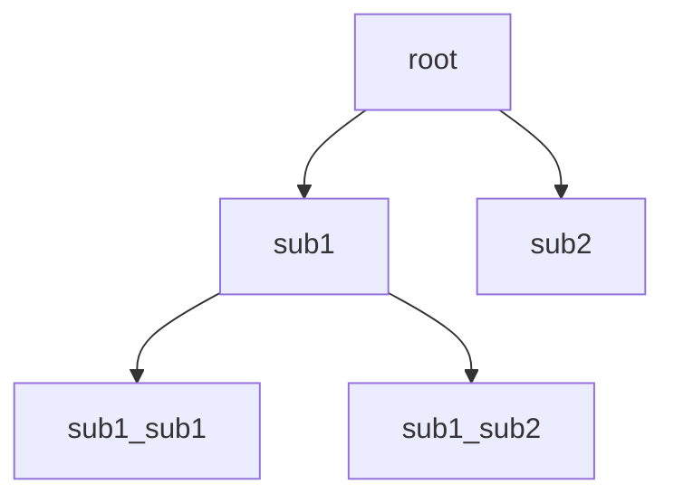

# 菜单系统使用指南

---

[TOC]

---

## 快速使用

### 1. 必要声明

+ 例如
```c
u8g2_t u8g2;                                        //u8g2句柄，需要自己实现初始化
menu_data_t* menu_data_ptr;                         // 用于跟踪菜单信息的数据结构体指指针
menu_item_t* root = NULL;                           // 对应的菜单节点句柄指针
menu_item_t* sub1 = NULL;                           // 子节点一
menu_item_t* sub2 = NULL;                           // 子节点二
menu_item_t* sub1_sub1 = NULL;                      // 子节点孩子一 
menu_item_t* sub1_sub2 = NULL;                      // 子节点孩子二  

// 这里可以声明多个节点句柄

```


### 2. 初始化

```c
root = create_submenu_item("root",NULL,NULL);                   // 初始化为子菜单项
sub1 = create_submenu_item("sub1",NULL,NULL);                   // 初始化为子菜单项
sub2 = create_submenu_item("sub2",NULL,NULL);                   // 初始化为子菜单项
sub1_sub1 = create_submenu_item("sub1_sub1",NULL,NULL);         // 初始化为子菜单项
sub1_sub2 = create_submenu_item("sub1_sub2",NULL,NULL);         // 初始化为子菜单项
```

### 3. 节点链接

```c
Link_Parent_Child(root, sub1);                                      // root -> sub1 (P:root C1:sub1)
Link_next_sibling(sub1, sub2);                                      // root -> sub2 (P:root C2:sub2)
Link_Parent_Child(sub1, sub1_sub1);                                 // sub1 -> sub_sub1 (P:sub1 C1:sub1_sub1)
Link_next_sibling(sub1, sub2);                                      // sub1 -> sub_sub2 (P:sub1 C2:sub1_sub2)
menu_data_ptr = menu_data_init(root);                               // 设置root为根目录
```

该数据结构为：



### 4. u8g2渲染

```c

u8g2_FirstPage(&u8g2);                              // u8g2渲染页
update_animation(menu_data_ptr);                    // 菜单动画时钟
do {
    show_menu(&u8g2,menu_data_ptr,3);               // 对于0.97存的OLED屏幕，三个节点是正好显示的最大数量
} while (u8g2_NextPage(&u8g2));
```