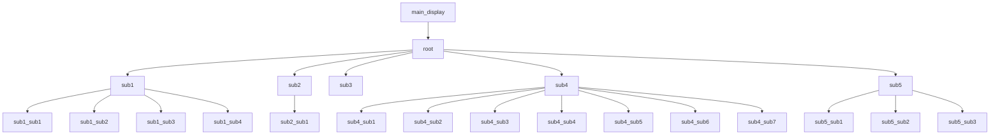

# 菜单系统

---

[toc]

---

## 概述

基于u8g2的树形结构的嵌入式菜单系统，支持多种菜单项类型和自定义渲染

> [!warning]
>
> 注意，此菜单没有默认的u8g2初始化函数，需自己实现u8g2初始化，
>
> 若同项目一样使用SPI屏幕，可通过[项目中的初始化函数实现初始化](../../u8g2_user/u8g2_user.c)
>
> ```tex
> 路径为
> C8T6_FreeRtos/
> |__________ u8g2_user/
> 		|_________ u8g2_user.c
> ```

## 核心特性

+ 树形菜单结构
+ 多种菜单类型
+ 原子操作保护渲染
+ U8G2图形库

## 数据结构

```c
struct menu_item_s {
    // 基本属性
    const char* text;           // 显示文本
    uint8_t sub_menu_count;     // 子菜单数量
    menu_item_type_t type;      // 菜单类型
  
    // 导航指针
    menu_item_t* parent;        // 父节点
    menu_item_t* first_child;   // 第一个子节点
    menu_item_t* last_child;    // 最后一个子节点
    menu_item_t* next_sibling;  // 下一个兄弟节点
    menu_item_t* prev_sibling;  // 上一个兄弟节点
  
    // 类型相关的数据和回调
    union {
        // 对于功能和子菜单
        void (*action_cb)(void); // 功能回调
    
        // 对于参数
        struct {
            int temp;           // 临时变量，用于存储当前编辑的值
            int* value_ptr;      // 参数值指针
            int min;             // 最小值
            int max;             // 最大值
            int step;            // 步进值
        } param_int;
    
        struct {
            int value_ptr_temp; // 临时变量，用于存储当前编辑的值
            int* value_ptr;      // 当前值指针
            const char** options;// 选项字符串数组
            int option_count;    // 选项数量
        } param_enum;
    
        struct {
            bool temp;            // 临时变量，用于存储当前编辑的值
            bool* value_ptr;     // 开关状态指针
        } toggle;
        struct {
           void (*main_display_cb)(u8g2_t* u8g2, menu_data_t* menu_data);
        }main;
    
    } data;

    // 可选的回调函数
    void (*on_enter)(menu_item_t* item);    // 进入该项时调用
    void (*on_leave)(menu_item_t* item);    // 离开该项时调用
    void (*on_change)(menu_item_t* item);   // 值改变时调用
};
```

## 节点类型

| 节点类型                               | 作用                                                                 |
| -------------------------------------- | -------------------------------------------------------------------- |
| 子菜单(`MENU_TYPE_SUB_MENU`)         | 作为层次桥接的重要节点，可在进入子节点时用户自定义初始化             |
| 功能选项(`MENU_TYPE_FUNCTION`)       | 用户可自定义的功能节点，用户可自定义                                 |
| 整形数值选项(`MENU_TYPE_PARAM_INT`)  | 用户可自定义**整形变量**范围增减量的选项(在本项目中并不会使用) |
| 枚举字符选项(`MENU_TYPE_PARAM_ENUM`) | 用户可自定义显示的字符串(在本项目可能会使用，待商议)                 |
| 开关选项(`MENU_TYPE_TOGGLE`)         | 用户**可开关**的节点                                           |
| 主界面(`MENU_TYPE_MAIN`)             | 用户可自定义的主界面渲染(需要用户会使用u8g2图形库)                   |
| 仅显示信息节点(`MENU_TYPE_DISPLAY`)  | 暂未实现                                                             |

## 当前项目的菜单结构



| 菜单节点         | 节点名称               | [类型](##节点类型)          | 简介                                                           |
| ---------------- | ---------------------- | ------------------------ | -------------------------------------------------------------- |
| `main_display` | `main`               | `MENU_TYPE_MAIN`       | 作为主界面渲染                                                 |
| `root`         | `main_menu`          | `MENU_TYPE_SUB_MENU`   | 根节点                                                         |
| `sub1`         | `param_int`          | `MENU_TYPE_SUB_MENU`   | 用于测试 `INT`串口协议类型的子菜单项                         |
| `sub2`         | `param_enum`         | `MENU_TYPE_SUB_MENU`   | 用于测试字符串枚举的类型的子菜单项                             |
| `sub3`         | `toggle`             | `MENU_TYPE_TOGGLE`     | 用于测试开关的类型的子菜单项                                   |
| `sub4`         | `Clock_Set`          | `MENU_TYPE_SUB_MENU`   | 用于设置时间的子菜单项，进入时会暂存时间数据                   |
| `sub5`         | `Set_passenger`      | `MENU_TYPE_SUB_MENU`   | 用于向ESP32发送顾客数据的子菜单项                              |
| `sub1_sub1`    | `SendUART_INT`       | `MENU_TYPE_FUNCTION`   | 发送一个 `INT`数据帧的节点，数据来源基于 `sub1_sub2`的变量 |
| `sub1_sub2`    | `Change_int`         | `MENU_TYPE_PARAM_INT`  | 更改整形数据节点                                               |
| `sub1_sub3`    | `SendUART_FLOAT`     | `MENU_TYPE_FUNCTION`   | 发送一个``FLOAT `数据的节点，数据固定为`3.3`                 |
| `sub1_sub4`    | `SendUART_ACK`       | `MENU_TYPE_FUNCTION`   | 发送一个 `ACK`信号                                           |
| `sub2_sub1`    | `Change_param`       | `MENU_TYPE_PARAM_ENUM` | 更改字符串数组下标，并渲染对应的字符串                         |
| `sub4_sub1`    | `seconds`            | `MENU_TYPE_PARAM_INT`  | 更改秒                                                         |
| `sub4_sub2`    | `minutes`            | `MENU_TYPE_PARAM_INT`  | 更改分                                                         |
| `sub4_sub3`    | `hours`              | `MENU_TYPE_PARAM_INT`  | 更改时                                                         |
| `sub4_sub4`    | `years`              | `MENU_TYPE_PARAM_INT`  | 更改年(向备份寄存器)                                           |
| `sub4_sub5`    | `monthes`            | `MENU_TYPE_PARAM_INT`  | 更改月(向备份寄存器)                                           |
| `sub4_sub6`    | `days`               | `MENU_TYPE_PARAM_INT`  | 更改日(向备份寄存器)                                           |
| `sub4_sub7`    | `Set_time`           | `MENU_TYPE_FUNCTION`   | 确定更改时间                                                   |
| `sub5_sub1`    | `Set_Passenger`      | `MENU_TYPE_PARAM_INT`  | 更改乘客数量，并向ESP32同步                                    |
| `sub5_sub2`    | `SendUART_Passenger` | `MENU_TYPE_FUNCTION`   | 顾客增一后并向ESP32同步                                        |
| `sub5_sub3`    | `clear`              | `MENU_TYPE_FUNCTION`   | 清除乘客数量并发送 `CLEAE`指令                               |

## 菜单系统的API

+ `menu_data_t* menu_data_init(menu_item_t* root)`
  返回值:                   menu_data_t句柄指针
  参数:                     menu_item_t节点指针，将此节点作为菜单的根节点

+ `menu_item_t* create_submenu_item(const char* text,void (*on_enter)(menu_item_t* item),void (*on_leave)(menu_item_t* item))`
  返回值:                   menu_item_t节点指针，将此节点进行初始化
  参数:        
    + `text`:               该节点在菜单系统的名称
    + `on_enter`:           在通过此菜单进入下一级菜单的行为之前所进行的动作
    + `on_leave`:           在通过此菜单进入下一级菜单的行为之后，在回到父节点后的所进行的动作
  注意: `on_enter`与`on_leave`所操作的`item`对象是访问的节点，即`on_enter`操作的是所选选项,`on_leava`操作的是它本身
+ `menu_item_t* create_function_item(const char* text, void (*action_cb)(void))`
  返回值:                   menu_item_t节点指针，将此节点进行初始化
  参数:        
    + `text`:               该节点在菜单系统的名称
    + `action_cb`:          通过enter操作后，所执行的操作
  注意: 若`action_cb`为空，则enter操作不会执行任何操作
+ `menu_item_t* create_param_int_item(const char* text, int32_t* value_ptr, int min, int max, int step);`
  返回值:                   menu_item_t节点指针，将此节点进行初始化
  参数:        
    + `text`:               该节点在菜单系统的名称
    + `value_ptr`:          通过菜单修改整形变量的指针
    + `min`:                通过菜单修改数值的最小值 
    + `max`:                通过菜单修改数值的最大值 
    + `step`:               通过菜单修改数值的步长
  注意: 
  menu_item_t* create_param_enum_item(const char* text,int32_t* value_ptr,const char** options,int options_nums);//字符串枚举菜单
menu_item_t* create_main_item(const char* text,menu_item_t* root,void (*main_display_cb)(u8g2_t* u8g2, menu_data_t* menu_data));
menu_item_t* create_toggle_item(const char* text,bool* value_ptr);//开关菜单